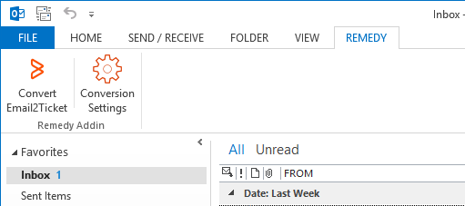
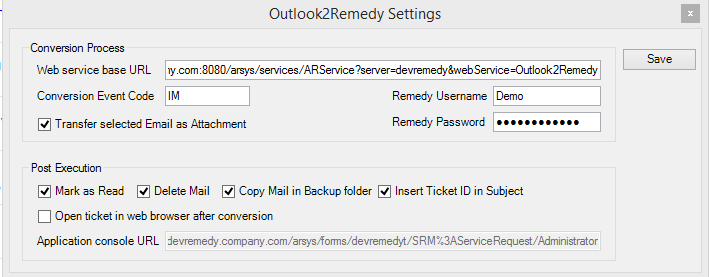

# Outlook2Remedy

**Outlook2Remedy** is an Microsoft Outlook add-in that allows you to handle emails 
through a Windows mail profile (usually described by a MAPI configuration) and to 
create tickets into **BMC Remedy** ticketing system using a staging area, allowing 
you then to transform staging records into standard or custom tickets by adding simple 
workflow to push data into the corresponding ticketing area (Incident Management, 
Service Request Management or a custom ticketing application developed over BMC Remedy
environment).

## Solution
The architecture has two layers: 
 - Outlook add-in module that will bring a dedicated area within Outlook to convert
   email into tickets and also to configure the entire process.
 - Remedy interface workflow that is a definition file stored in `def` folder (see 
   in the distribution archive or in project structure) 

After installation of add-in binaries Outlook will show a new tab called _REMEDY_ 
having on two specific buttons:

 
 * **Convert2Ticket** | Selecting any email document from _Inbox_ or from any other 
 folder from Outlook profile will send it in Remedy - more specific into the staging 
 form (`Outlook2Remedy` form), according to the rules and configuration settled for
 this data transfer in Remedy.
 

 
 * **Conversion Settings** | Using this option your can personalize your data transfer 
 flow within both Remedy and Outlook areas; you can specify what should happen with 
 the selected email document after conversion and also you can describe what email
 components are considered in the conversion process.

Remedy workflow (located in `def` folder) must be imported using _BMC Remedy Developer 
Studio_; it is recommended to import it before installation of add-in binaries and two 
additional objects will be created within Remedy server container:
 1. `Outlook2Remedy` regular form, considered staging layer in this data conversion flow
 2. `Outlook2Remedy` SOAP web service which makes possible data transfer from Outlook to Remedy.

In addition, it is recommended to run data transfer using a dedicated Remedy account that 
should have write permissions in `Outlook2Remedy` form to access `Outlook2Remedy` 
web services.
The workflow objects will be imported as _custom objects_ (and not _base objects_) just to allow
you to change them or to adapt them based on your needs preserving the philosophy of an open-source 
project.

## Installation
In order to install **Outlook2Remedy** solution you have to run the following steps:
 1. Download the latest release archive (`Outlook2Remedy.zip` file published in _release_ area)
    and upzip it.
 2. Import `Outlook2Remedy.def` definition file located in `Outlook2Remedy/def` folder using 
    _BMC Remedy Developer Studio_; import the definitions on all servers that are part of your
	environment (test, dev, production, etc.)
 3. Copy the entire `Outlook2Remedy` folder	(made by unzip) into location
    `C:\Users\<username>\AppData\Roaming\Microsoft\AddIns`. The indicated location is per 
	specific Windows account, so in case you want to install the add-in for many users on 
	the same workstation you have to copy the `Outlook2Remedy` folder in all your user profiles.
 4. Run through double-click `Outlook2Remedy.vsto` installation script located in 
    `C:\Users\<username>\AppData\Roaming\Microsoft\AddIns\Outlook2Remedy` folder. The add-in is 
	signed by a self-sign certificate, so you have to trust it and confirm it during installation.
	In case you need to install it isolated, try to download  `Outlook2Remedy.pfx` file from 
	source code and then to install it in the standard way (the password for private key is 
	_Outlook2Remedy_).
	***Note***: Before to run `Outlook2Remedy.vsto` installation script close all open 
	_Microsoft Office_ applications (especially _Outlook_)

### Compatibility
The Add-in has been tested on ***Microsoft Outlook 2013*** and ***Microsoft Outlook 2016***.
From ***BMC Remedy*** perspective there is no limitation, the conversion workflow should work 
over any ***Remedy Action Request System*** version (legacy versions like 7.6.x or 8.x, or 
latest 9.x versions).

## Configuration
After add-in installation, open **Outlook** and go to **REMEDY** new tab; there it will be 
available **Conversion Settings** button that will open the dialog described by the 2nd 
screenshot. Actually, this is the configuration area of the data transfer flow, allowing you to
personalize the workflow for each user.

 * **Conversion Process** - This category of configurations are considered during conversion
   workflow, driving the process to the specific Remedy server, specific web service are related action.
   * ***Web service base URL*** - This is the complete URL to the `Outlook2Remedy` web service
     action (not `WSDL`); The URL should look like the example described below are should refer 
     production or test remedy server - according to your direct goal.
     URL example: `http://devremedy.company.com:8080/arsys/services/ARService?server=devremedy&webService=Outlook2Remedy`
   * ***Conversion Event Code*** - This is a mandatory fields describing the ticketing workflow identifier
     that the conversion process belongs to. Because in the company may stand many service desk teams that  
	 convert the emails from a shared mailbox into tickets for different Remedy applications, this 
	 field allows to segregate the workflows; for instance one service desk team will convert emails into
	 _Incident Management_ application and another one into a custom HR ticketing system. So, this field helps
	 you to segregate the workflow being submitted in staging form in field `EventCode` (ID `8`). Building your 
	 custom workflow over staging form you can spread the emails to the corresponding Remedy applications. 
   * ***Transfer selected Email as Attachment*** - this is a self-explanatory option, allowing you to transfer
     into the ticket the email document (including corresponding attachments) as a separate file (with `msg` 
	 extension, being a=readable with _Outlook_ office application). The file will be stored into an attachment 
	 field in staging form, more concrete in `EmailAttachment` attachment pool field and `EML` attachment field 
	 (ID `650000004`) - size is unlimited.
   * ***Remedy Username*** - Remedy transaction into the staging form is done under a specified Remedy user 
     account; this Remedy user should have write permission in staging form and also should be able to access the
	 web service. The account will be stored `AssignedTo` and `LastModifiedBy` core fields and the Windows account
	 name of the user that performs the transaction will be stored in `Submitter` core field (ID `2`).
   * ***Remedy Password*** - This is the password of Remedy account that should perform the transaction; in case 
     the password is not good or the account doesn't exist the web service will return an error message (shown in
	 Outlook as a message box and also will be recorded in `temp/errors.log` file from add-in location)
 * **Post Execution** - These settings allow you to configure post-transaction workflow, more concrete decide how
   to handle the converted emails.
   * ***Mark as Read*** - Mark converted email as Read email (in case it was unread before conversion)
   * ***Delete Mail*** - Delete converted email (only successfully converted emails)
   * ***Copy Mail in Backup folder*** - Copy converted email into `INBOX/Backup` MAPI folder. In case the folder
     doesn't exist it will be created and then the email is copied.
   * ***Insert Ticket ID in Subject*** - Once the email is converted and transferred into fulfillment application
     the ticket ID ( field Id `1`) from targeted Remedy application should be registered into `RelatedTicketID` 
	 field (ID `650000005`) from staging form and returned back to _Outlook_ that will recorded into email 
	 _Subject_, so the email document will be updated adding the returned ticket ID as prefix of the existing subject.
	 In case fulfillment application is not connected to the staging form through a custom workflow then the staging 
	 record will be returned to _Outlook_ and inserted into the subject.
   * ***Open ticket in web browser after conversion*** - This options allows you to open the corresponding fulfillment
     ticket through the default system web browser. This action is facilitated by the next option where the direct
     fulfillment form URL is specified. In case this option is not selected, after email conversion _Outlook_ will 
	 display a message box with the returned ticket ID.
   * ***Application console URL*** - This option is activated in case the previous one is selected and describes the
     fulfillment form URL that is able to display the ticket in `MODIFY` mode using `EID` reference method (in Remedy), 
	 see the URL example: `http://devremedy.company.com:8080/arsys/forms/devremedy/SRM%3ARequest/Administrator`

## Development

 > [ToDo's list](doc/ToDo.md)
 
 > [Definition file](def/Outlook2Remedy.def)
 
 > [Add-in signing certificate](Outlook2Remedy.pfx)
 
 
 
This library is distributed in the hope that it will be useful, but WITHOUT ANY WARRANTY; including but not limited to, the implied warranty of MERCHANTABILITY, NONINFRINGEMENT, or FITNESS FOR A PARTICULAR PURPOSE. See the GNU Lesser General Public License for more details.
